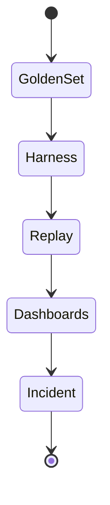

Retrieval is the most brittle link in the RAG chain. Corpora change, embeddings drift, and analysts route new document types through the system every week. Without a disciplined evaluation program, teams ship blind spots directly into production. We have adapted the same observability mindset we bring to distributed systems—traces, dashboards, incident playbooks—to retrieval. The playbook below is what we run for every enterprise deployment.

## Define success metrics the business understands

Before writing a single test, align on the metric that matters to the workflow. Common picks include:

- **Reference recall** – ability to return required documents within the top `k`.
- **Coverage** – percentage of workflows that include at least one trustworthy citation.
- **Freshness** – age of the newest document in the returned set.
- **Latency** – total time from user request to documents ready for prompting.

Translate those metrics into service-level objectives (SLOs). For example, "Recall@5 must exceed 0.85 for regulatory documents uploaded within the last 30 days." Once the business signs off, every engineer knows what "good" means.

## Curate golden datasets continuously

Golden datasets are your regression oracle. Instead of treating them as a one-time artifact, maintain them like code:

1. **Seed** – Ask subject-matter experts for canonical question-answer-document triples.
2. **Expand** – Sample production traffic, anonymize it, and append the human-reviewed cases.
3. **Label** – Tag each case with metadata such as region, product line, and compliance tier.
4. **Version** – Store datasets in Git, attach pull requests, and keep metadata describing the corpus snapshot they represent.

We keep the datasets small (50–200 cases per workflow) so they are easy to review every sprint. When the corpus structure changes, we update the dataset as part of the rollout checklist.

## Build automated offline harnesses

Once you have golden datasets, wire them into an automated harness. We prefer a plain TypeScript runner because it integrates cleanly with CICD:

```ts
import { retriever } from "../retriever";
import cases from "./cases.json";

for (const testCase of cases) {
  const docs = await retriever.fetch({
    query: testCase.query,
    filters: testCase.filters,
  });
  const recall = evaluateRecall(docs, testCase.expectedSources);
  if (recall < testCase.minRecall) {
    throw new Error(`Recall dropped to ${recall} for ${testCase.name}`);
  }
}
```

The harness runs nightly and on every PR that touches ingestion, embeddings, or retrieval logic. Failures tag the owning team automatically.



## Replay production traffic

Offline tests catch regressions, but they cannot cover the long tail. We capture a privacy-safe sample of production queries (stripped of user identifiers) and replay them through the latest retrieval stack. The workflow looks like this:

1. Append metadata: time, tenant, workflow, and even the model response ID.
2. Replay the queries through the current stack and store the returned documents.
3. Score the runs with either human reviewers or a judge model that knows the golden answers.
4. Feed the scores back into BI dashboards.

When scores dip, we look for correlations in metadata: a new tenant, a new document type, or a specific retriever.

## Instrument everything

Evaluations are only useful if you can trace the results to specific components. We integrate retrieval into the same observability spine we describe in the [LLM observability offering](/llm-observability):

- Emit spans for chunking, embedding, dense retrieval, sparse retrieval, and re-ranking.
- Attach attributes for dataset version, embedding model, and tool budgets.
- Log the IDs of every document returned, plus any that were filtered out for policy reasons.

With those spans in hand, we can answer questions like "Why did recall drop yesterday?" within minutes.

## Automate freshness monitoring

Retrieval quality collapses when ingestion pipelines fall behind. We add freshness monitors that compare the latest document timestamp per corpus against a threshold. If ingest lags, we page the on-call engineer before users notice stale answers.

## Triage with incident playbooks

Treat evaluation failures like outages. When recall or precision dips, we pull up a playbook:

1. Check ingestion pipelines for errors or unusual retries.
2. Inspect embedding job metrics (latency, batch size, GPU errors).
3. Review retriever logs to see if filters or namespaces changed unexpectedly.
4. Roll back to the last known-good dataset if necessary.

Because the evaluation harness emits structured logs, we can trace each failure back to the exact document set and retriever invocation.

## Close the loop with stakeholders

Dashboards are useful, but stakeholder context is better. Every week we publish a memo describing:

- Evaluation results vs. SLOs
- Open issues and owners
- Corpus changes released that week
- Planned improvements

These memos live alongside architecture docs so leadership sees the rigor behind the system.

## Final reminder

Retrieval quality is not a "nice to have". It is the difference between an assistant that analysts trust and one they ignore. By combining offline harnesses, traffic replay, observability, and human-friendly reporting, you create a virtuous cycle: issues surface early, teams respond quickly, and the agent keeps shipping value even as the corpus shifts daily.
