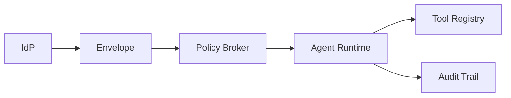

IAM maturity determines whether your agent stays in production. We keep seeing the same smell: a prototype that authenticates users at the UI layer but drops all context as soon as the request hits the agent runtime. After that, the agent calls tooling with shared credentials, every action looks identical in logs, and audit teams panic.

The patterns below summarize how we propagate identity through the stack, enforce least privilege, and give auditors the evidence they require. You can layer each pattern incrementally regardless of cloud provider.

## 1. Identity envelope per request

Start by packaging the caller's identity and entitlements as a single immutable envelope. The envelope should contain:

- User ID and organization ID
- Normalized roles (e.g., `analyst`, `customer-success`)
- Derived entitlements (`canViewPhi`, `region="EU"`)
- Session metadata (device, mfa strength)

We forward this envelope via headers or metadata fields so every microservice reads from a single source of truth. In Next.js, a middleware can hydrate the envelope and forward it to the agent API:

```ts
const envelope = {
  userId: session.user.id,
  orgId: session.org.id,
  roles: session.roles,
  entitlements: deriveEntitlements(session),
};

await fetch("/api/agent", {
  method: "POST",
  headers: {
    "x-agent-identity": Buffer.from(JSON.stringify(envelope)).toString("base64"),
  },
  body: JSON.stringify(payload),
});
```

Inside the runtime we decode the envelope and attach it to every tool call, prompt, and event log. That envelope is later used by the monitoring stack to prove who did what.



## 2. Tool registries with IAM guardrails

Most teams hardcode tool invocations in the agent logic. We centralize every tool definition in a registry that captures name, scopes, cost budgets, and the IAM attributes required to invoke it. When the agent wants to call a tool, it asks the registry for a signed capability. If the identity envelope lacks the proper entitlements, the registry denies the request with a justification.

The registry also decorates each tool execution with a `policyDecisionId` that is logged alongside the request. When auditors ask why a tool was allowed, we can respond with deterministic data.

## 3. Dynamic policy injection into prompts

Prompts should not be static strings. Inject IAM context so the model understands boundaries. We embed short policy snippets:

```
You are assisting an analyst with EU accounts only. Never expose ticket data outside of region="EU". If a request references other regions, respond with "Need review".
```

When policies change, we update the snippet from a centralized store so every prompt inherits the change automatically. This is cheaper and faster than retraining or redeploying the agent runtime.

## 4. Scoped credentials per workflow

Avoid the temptation to share one API key across the entire agent. Instead, mint scoped credentials tied to the user's IAM context. At minimum:

- Use OAuth client credentials with per-tool scopes for backend-to-backend calls.
- Rotate credentials via the same secrets manager used by your existing services.
- Emit structured logs whenever a credential is used so security analysts can detect anomalies.

## 5. Just-in-time approvals

Certain workflows—fund transfers, publishing incidents—deserve human approvals. We implement JIT approvals by pausing the agent workflow, persisting the context payload, and notifying the approver via Slack or ticketing systems. The approval event references the same identity envelope plus a hash of the payload to guarantee integrity.

This pattern keeps agents inside compliance boundaries while preserving automation for low-risk steps.

## 6. Immutable audit trails

Every action should produce a log entry that contains:

- Identity envelope (or hash)
- Tool invoked and arguments
- Prompt template ID
- Retrieval sources
- Policy decision outcome
- Model response metadata (tokens, latency)

We stream these logs into the same SIEM or observability platform your security team already trusts. During tabletop exercises we walk through how to export the relevant entries within minutes.

## 7. SaaS multi-tenancy

When supporting multiple customers inside a shared agent stack, we isolate tenants at three levels:

1. **Data** – per-tenant storage or strict row-level security with row ownership enforced at the database level.
2. **Vector stores** – either separate indexes or namespacing that is cryptographically enforced.
3. **Secrets & tooling** – each tenant registers its own tool credentials; the runtime never mixes them.

Tag every trace and log entry with the tenant identifier so suspicious activity is easy to scope.

## 8. Delivery process

IAM is not only a technical exercise. We codify the policies in architecture memos, review them with security, and include them in the rollout checklist. The same rigor we describe on the [LLM security & IAM offering](/llm-security-iam) applies to internal platforms. If your organization cannot describe how entitlements flow through the runtime, you are not production-ready.

## Takeaway

Successful agentic programs treat IAM as a product surface. The patterns above improve security posture while giving product teams the freedom to move fast. Start with the identity envelope, add the tool registry, and ship structured logs from day one. By the time the compliance team asks for evidence, you will already have the answers.
