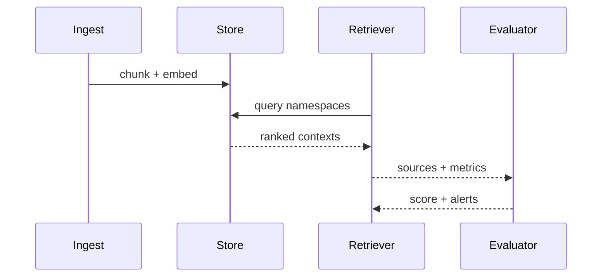

Retrieval-augmented generation (RAG) looks straightforward on a whiteboard: embed content, store it, stuff it into prompts, and profit. The real world introduces compliance reviews, version control, flaky connectors, and analysts who need proof that the answer was trustworthy. Over dozens of enterprise launches we distilled the recurring guardrails into a checklist that can be applied whether you run on Vertex, Bedrock, or self-hosted infrastructure.

You do not need to implement every item on day one, but ignoring the basics guarantees a rollback. Treat the list below as a living artifact shared with security, data, and product stakeholders.

## 1. Corpus operations

**Source inventory** – Know exactly which data sets feed the RAG system. We maintain a table with dataset owners, refresh frequency, and classification (public, internal, regulated). If a compliance officer asks which sources power the agent, the answer should not require spelunking through pipelines.

**Connectors with deterministic retries** – PDF scrapers, CRM exports, and wiki APIs all fail differently. Wrap every connector with exponential backoff and metrics. We prefer queue-driven ingests because they expose dead-letter queues when a batch refuses to parse.

**Schema validation** – Embed pipelines should fail loudly if the input schema shifts. We inspect the document before encoding to ensure required fields exist and that redaction rules ran.

## 2. Embedding management

**Versioned embeddings** – Treat embeddings like compiled artifacts. We store the model, tokenization settings, and chunking strategy alongside the vector files. When we retrain or change chunk sizes we write a migration document describing why.

**Dual storage** – Dense vectors are powerful, but they are not the only signal. Pair them with sparse indices (BM25, keyword search) or relational lookups for structured data. We maintain connectors that can query multiple stores and return a unified ranked list.

**Access control** – Embedding stores often lack fine-grained permissions. We overlay IAM policies at the application layer to ensure a user cannot retrieve chunks they are not allowed to see.

## 3. Retrieval evaluation

You cannot manage what you never measure. Our baseline includes two loops:

- **Golden datasets** with curated question → answer → document mappings that run nightly. These highlight regressions when someone updates chunking or vector normalization.
- **Production sampling** where we replay anonymized prompts and score them automatically or manually.

Metrics worth tracking:

- **Recall@K** for each store.
- **Source agreement** between dense and sparse retrievers.
- **Mismatched metadata** (e.g., returning a document outside the user’s geography).
- **Latency per request**.

We publish evaluation dashboards before any executive briefing. That gives stakeholders confidence that the "AI" answer is measurable, not magical.

## 4. Response assembly

**Context windows** – Tune how much of each document flows to the prompt. We log the number of tokens consumed by every document chunk so we can optimize cost and accuracy at once.

**Citations** – Always attach citations with source IDs, timestamps, and optionally snippets. When analysts question an answer, they should be one click away from the underlying evidence.

**Fallback strategies** – Sometimes retrieval fails. Decide whether you will (a) return a deferment, (b) ask the user for clarification, or (c) escalate to a human. Logging the fallback reason is essential for triage.

## 5. Policy and compliance

Legal teams worry about provenance and privacy. Bake these into the runtime rather than into a slide deck:

- Mask or strip regulated data before it hits the embedding pipeline.
- Separate storage for regulated and non-regulated content so retention policies can diverge.
- Attach data classifications to each chunk and propagate them through prompts for auditing.

We frequently embed policy metadata such as `{region: "US", phi: true}` into the retrieval payload. The downstream agent can then block or reroute the request if the current user lacks clearance.

## 6. Operations and observability

A RAG system without telemetry is a compliance nightmare. Minimum viable instrumentation includes:

- **Trace IDs** covering ingestion, retrieval, and generation.
- **Structured logs** capturing which documents were returned and which were filtered for policy reasons.
- **Cost accounting** broken down by corpus, tenant, and workflow.

We wire these signals into existing observability stacks so incident response stays familiar. When a regulator asks for an audit trail, we can export traces plus retrieval payloads directly from the logging system without ad-hoc scripts.

## 7. Delivery cadence

Teams that treat RAG as "magic" usually burn cycles chasing inaccurate answers. Teams that operate like a traditional software org succeed faster. Our cadence borrows from playbooks we use on [knowledge & RAG systems](/rag-systems) engagements:

1. Architecture memo reviewed by security, data, and product stakeholders before sprint one.
2. Ingest pipelines with automated tests and dashboards.
3. Evaluation harnesses wired into CI so regressions fail builds.
4. Executive-friendly KPI dashboards (coverage, accuracy, cost) published weekly.

## Final thought

The checklist above is intentionally opinionated. RAG succeeds when you treat it like an operational system, not a chatbot. If you can answer "yes" to each item, you are far less likely to roll back after the first compliance review. Keep the document living—attach owners, dates, and open questions—so leadership sees the rigor behind every release.
