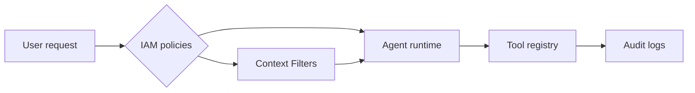

The pitch for agentic applications is simple: point an LLM at your knowledge base, wire up a few tools, and watch a co-pilot materialize. In reality, most initiatives collapse before anyone outside the lab sees value. The failures rarely stem from model choice. They come from the unglamorous layers—identity, retrieval quality, cost controls, and incident response—that make enterprise software boring in the best possible way.

Below are the recurring antipatterns we continue to remediate when a team asks us to rescue an engagement. If you fix even two of them early, you are miles ahead of the average organization.

## No IAM plan, only API keys

Agent demos usually hide behind a single API key or a prototype auth layer. Then week ten hits, security shows up, and suddenly you are rewriting every call site. Without identity propagation, you cannot enforce least privilege or prove who saw what.

We recommend threading IAM data through the runtime from the very start:

```ts
// Example Next.js middleware mapping IdP claims to the agent runtime
export async function middleware(request: NextRequest) {
  const session = await getSession(request);
  const identity = {
    userId: session.user.id,
    role: session.user.role,
    scopes: session.entitlements,
  };

  const headers = new Headers(request.headers);
  headers.set("x-agent-identity", JSON.stringify(identity));
  return NextResponse.next({ request: { headers } });
}
```

Once identity context rides along with the request, the agent runtime can apply policies when selecting tools, constructing prompts, or pulling documents. We routinely enforce IAM decisions at three checkpoints:

1. **Prompt assembly** – redact or swap sensitive context before the model ever sees it.
2. **Tool execution** – ensure downstream APIs only receive scoped credentials.
3. **Response shaping** – filter actions or next steps based on entitlement.

This is the same blueprint used on our [agentic application consulting](/agentic-application-consulting) engagements. The difference is that we codify it before anyone writes speculative UI.



## Retrieval quality is never evaluated

Agent demos usually "feel" smart because the creator cherry-picked context. Move the agent into a noisy corpus and it falls apart. Evaluation is the unglamorous habit that separates a reliable knowledge workflow from a toy.

We run two complementary evaluation loops:

- **Offline regression harnesses** built with golden datasets (documents, questions, expected rationales) that run on a schedule.
- **Production sampling** where we replay real queries and score them manually or with a judge model.

The regression harness is implemented exactly like any other test suite. Here's a trimmed-down Jest-style pseudocode we use during onboarding:

```ts
const cases = await loadGoldenCases();

describe("retrieval", () => {
  cases.forEach((testCase) => {
    it(testCase.name, async () => {
      const contexts = await retriever.fetch(testCase.query);
      const score = evaluateRecall(contexts, testCase.expectedSources);
      expect(score).toBeGreaterThanOrEqual(0.8);
    });
  });
});
```

Outputs from these harnesses feed dashboards shared with compliance, product, and leadership. When recall dips, we already have the delta packaged for the next sprint.

## Tooling without guardrails

The "agent can do anything" aspiration collides with regulatory reality. Without scopes, rate limits, or budgets, a single runaway tool call can breach data-sharing agreements or rack up five-figure bills overnight.

We isolate tools behind a declarative registry that captures:

- **Who** can call it (based on IAM context)
- **Where** it can run (prod, staging, sandbox)
- **How much** it may spend per invocation or per batch
- **What** happens when it fails (retry, circuit breaker, or human review)

The runtime enforces those rules on every call. When we inherit a prototype, we usually find tools instantiating SDK clients inline with no telemetry and no policy enforcement. The first refactor is always to build a registry and push calls through a single dispatcher. That dispatcher exposes a consistent log format so security teams can audit with the same ease as they audit API traffic.

## No observability, no incident plan

The absence of observability explains why so many teams pull their agentic pilots after a single bad incident. If you cannot trace a request from ingress to model output, you cannot explain to leadership what went wrong.

We embed tracing, metrics, and logging before QA ever touches the experience:

- Structured spans cover prompt templates, retrieval sets, tool arguments, and downstream response times.
- Metrics split by tenant, workflow, and intent so business owners can see cost-per-outcome.
- Guardrail events and policy decisions are logged as first-class trace attributes.

On top of instrumentation we add the incident response basics: paging policies, "break glass" roles, and a workflow that routes unresolved issues to humans. Most teams treat this as a post-launch chore. We treat it as part of the build.

## Delivery patterns ignore reality

The final failure mode is a people issue. Teams sprint toward a vague milestone, executives see a demo, and then nothing happens for three months because no one agreed on acceptance criteria. Agentic work already includes enough ambiguity; the delivery process should be boring.

A resilient delivery plan has three elements:

1. **Architecture before build** – threat models, IAM design, and retrieval diagrams that stakeholders can critique early.
2. **Milestones tied to measurable outputs** – e.g., "Tracing spans emitted to DataDog" rather than "Observability done."
3. **Async communication** – weekly memos, short Loom walkthroughs, and clear owners so decisions survive across time zones.

Teams that follow this cadence rarely scramble. Everyone else ends up on a never-ending pilot.

## Bringing it together

If you internalize the patterns above, "production-ready" stops being a vague aspiration. You have a checklist: identity propagation, retrieval evaluation, guardrails, observability, and disciplined delivery. Each item is measurable. Each disciplines the system so that when the model does something surprising, the blast radius is containable.

Agentic applications are not inherently fragile. They simply break under organizations that treat them like side projects. Build with enterprise guardrails from day zero, and you end up with a system that leadership can trust and operators can debug.
